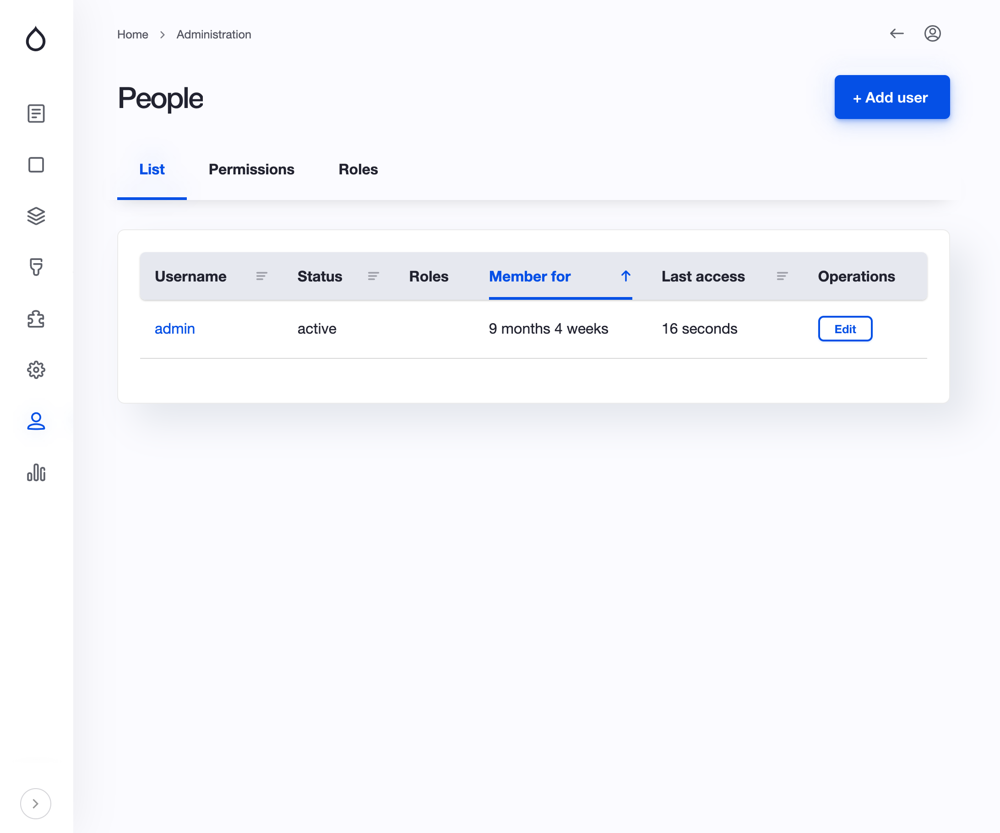

# Backend
Novartis Foundation Assessment backend
## Running locally
A docker-compose configuration is provided within the project. It includes following containers: php (7.4 alpine), apache and database (mariaDB 10.4)
To spin up everything you have to follow the following steps:
### Using the provided configuration
```
Copy .env.docker to .env
Run make setup
```

### Without using the provided local configuration
Every instructions used to run the app is defined within the Makefile (e.g: setup is handled by the `do_setup` function). You can run the application in any other way following these instructions

### Database
In the documentation folder, a database is provided with the question for the project. This database will help you to get started one the project is running. It provided with Questions, Area, Pillars, etc. Please copy the content to your Drupal Database to have the project run.

## Application structure
The application is based on Drupal's composer scaffold. Following statements applies to the application:
- Drupal is used in a headless mode and doesn't have a frontend theme
- Features are provided by the `novartis_quiz` module
- Configuration is located at `api/config/sync`
- Everything can be ported to any drupal ^8.8 || ^9 instance by copying the `composer.json` file , the `novartis_quiz` module and configuration to the corresponding directories.

## Contrib modules/theme required
- Config ignore & config split
- Paragraphs
- Inline entity form
- Country: exposes a country field which is used by the api
- Simple OAuth: provide OAuth endpoints
- Gin: Administration theme
- Drush

## API Endpoints
- GET /api/area: Returns the list of areas
- GET /api/session/: Retrieves the corresponding session
- POST /api/session: Starts a new session and returns the session id
- POST /api/session//result: Adds the given area result to the given session
- GET /api/dashboard/sessions: Returns the list of sessions for the dashboard
- GET /api/dashboard/stats: Returns the list of statistics for the dashboard

## User creation / edition

To add a new user to the admin dashboard, you need to visit the admin dashboard and under `/people` you will be able to add / edit users.

