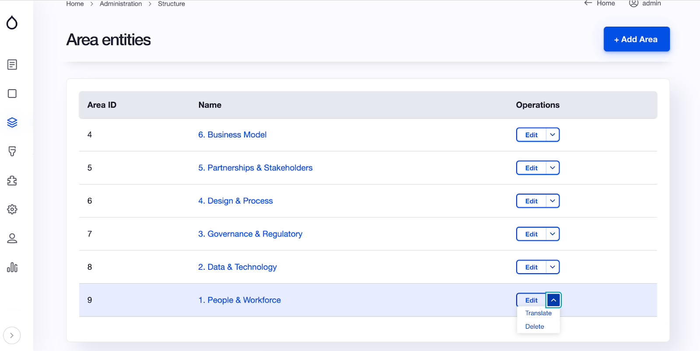
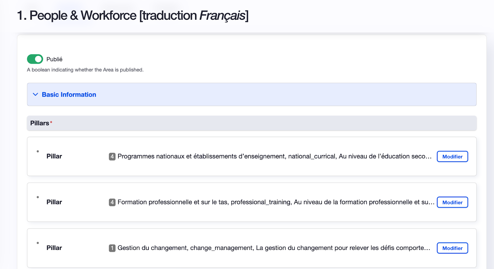

# Questions
Novartis Foundation Assessment Questions

## About the structure of the assessment
The assessment is divided into 6 Areas, who are divided into several pillars with their own questions. 
Each area represents a key theme in artificial intelligence. A pillars allowed, thanks to the attached questions, to assess the respondent on his level of maturity in artificial intelligence.

## How to edit a question ? 

From the main menu on the left, in the Quizz section (represented by a square pictogram), click on 'Area List (Figure 1)

<figcaption align="center"><b>Figure 1</b></figcaption>   

On the Area List’s screen (figure 2), you’ll be able to choose which area you want to modify by clicking on the 'edit' button or by clicking directly on the area name.

<figcaption align="center"><b>Figure 2</b></figcaption>  

When you choose an area, you will see the different pillars that compose it. (Figure 3)

<figcaption align="center"><b>Figure 3</b></figcaption>  

To access the questions, click on the edit button of the pillar of your choice.

Now, you can edit everything associated to a question (Figure 4 and 5)

Figure 4 is showing you how to edit :

- Title of the pillar
- Title of the question
- Theme of the question

<figcaption align="center"><b>Figure 4</b></figcaption>  

Figure 5 is showing you how to edit :

- Title of the answer
- The tooltip (if you want to give a tips, a clarification or a hint to the respondent)
- The score (choose between 1 - 5 - 10)
- The image or the Emoji associated to the answer

<figcaption align="center"><b>Figure 5</b></figcaption>  

To edit an image or an emoji, you must go to the ‘’answers’’ part linked to the question of your choice and click on ''remove''. (Figure 6)

<figcaption align="center"><b>Figure 6</b></figcaption>  

Now that your image or emoji is removed. You can add a new image to your answers. (Figure 7)

<figcaption align="center"><b>Figure 7</b></figcaption>  

To add your image, click on ‘Choose File’ and upload the image of your choice from your computer. Congratulations, your new image is now uploaded.

### How to translate the assessment ?

In the main menu on the left, in the Quizz section (represented by a square picto), click on 'Area List (Figure 1)

<figcaption align="center"><b>Figure 1</b></figcaption>  

You will see all the area entities (Figure 2) and you just have to click on the down arrow next to the edit button to be able to click on the ‘translate’ button.

<figcaption align="center"><b>Figure 2</b></figcaption>  

You are now on the screen regrouping all the translation of the area you choose. (Figure 3)

<figcaption align="center"><b>Figure 3</b></figcaption>  

To start the translation, click on the edit button of the language of your choice. (Figure 4)

<figcaption align="center"><b>Figure 4</b></figcaption>  

You have access to the first Area ready to get translated. (Figure 5)

<figcaption align="center"><b>Figure 5</b></figcaption>  

Choose the pillar of your choice and fill in all the structure with the appropriate language (Figure 6).

<figcaption align="center"><b>Figure 6</b></figcaption>  

You can repeat the operation through the whole assessment and the different areas.